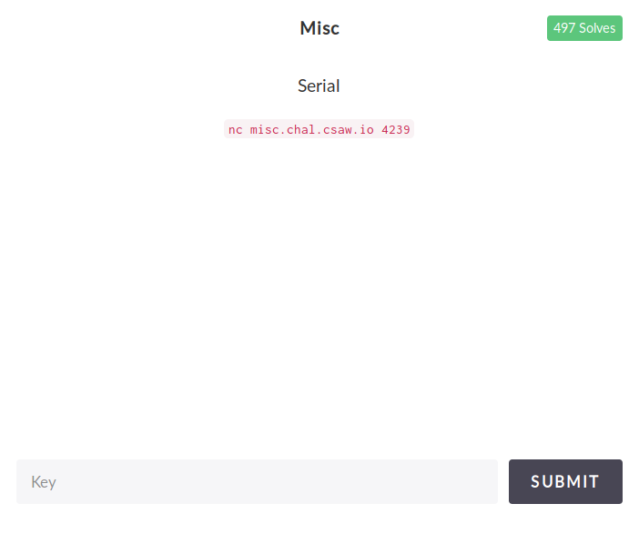

=== Serial

I had never dealt with parity before, so this was a new concept to learn on the fly. I had always heard about it and understood what it did, but actually programming parity was new for me.

Also, I have included the linux challenges as a submodule of this repository, so if you want the files for the submodule make sure you do `git pull --recurse-submodules`. This challenge is specifically in the link:https://github.com/isislab/CSAW-CTF-2017-Quals/tree/922816673685538940b3ce0e375f134d8f305c94/misc/serial/[CSAW-CTF-2017-Quals/misc/serial/] folder to view the files they used in the challenge.

==== Problem

Here was the problem I was presented with.

===== Solution

link:parity.py[Here] is my code for solving the problem

===== Video

Here is a termanal capture of me solving the problem. I didn't solve it this quickly but to make the video concise I just put how to get the answer.

image::https://asciinema.org/a/mLvXLQnwrX9bBr0RB19ewrxjC.png[asciicast, link="https://asciinema.org/a/mLvXLQnwrX9bBr0RB19ewrxjC"]
