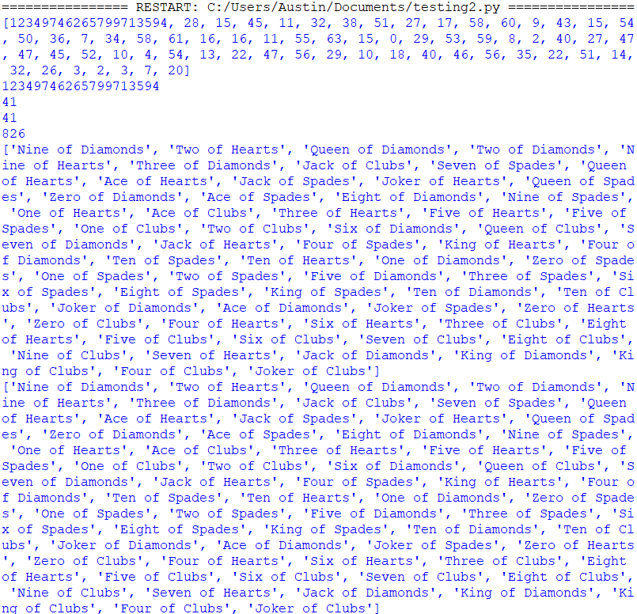
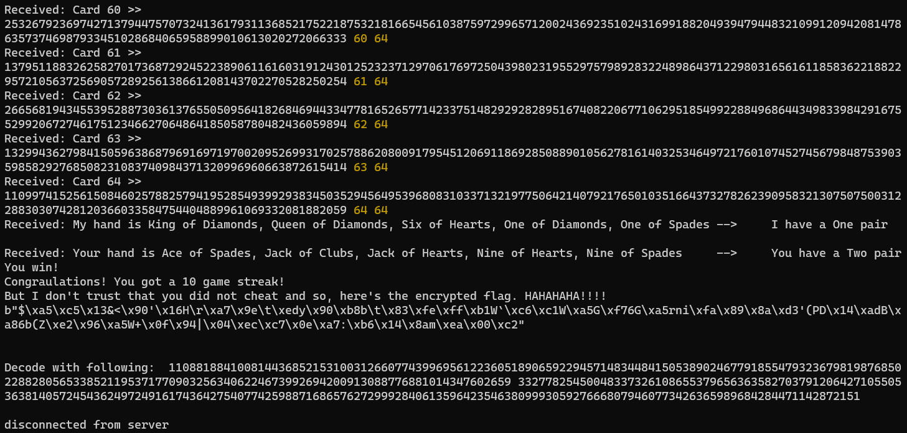
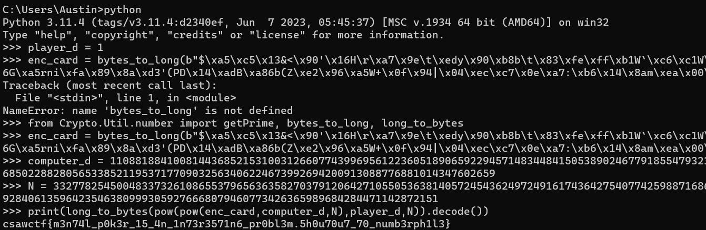

# Crypto: Mental Poker

**Points:** 488

**Author:** Dhyey Shah (CTFd)

**Description:** Let's play some mental poker.

`nc crypto.csaw.io 5001`

**Files:** [server.py](files/server[1].py)

## Writeup

This challenge was probably my favorite of the entire competition!

Luckily, we are given the source code, which helps us understand the steps we need to perform and the encryption used.

Here are the steps the program follows:
1. Create a deck of cards in a predictable manner to then shuffle randomly.
2. Get the values of p, q, phi, and N for RSA encryption. p and q are prime numbers, phi = (p-1)(q-1), and N is the modulus, equal to p*q.
3. Give the values of p and q to the user for the purpose of generating their own public and private keys.
4. Receive the user's public exponent (commonly referred to as e).
5. Receive the user's private exponent (commonly referred to as d).
6. Start the first rounds of the game.
7. Shuffle the deck at the start of each round using a custom pseudorandum number generator (PRNG).
8. On the first round, generate the computer's public and private keys also using the same PRNG.
9. Encrypt all shuffled cards using RSA with both the computer's and user's public keys.
10. Give the user the list of all encrypted cards.
11. Read back the encrypted cards from the user one-by-one in the order they choose. Verify these are valid cards by decrypting them and comparing them to cards in the deck.
12. Verify that there are no duplicates in the shuffled deck. If there are duplicates, there is an error thrown.
13. Pick the first 5 cards to be the computer's hand and the next 5 as the player's hand.
14. Determine the winner based on the combinations and ranks of the cards in each player's hand. This also sorts the hands by rank.
15. Print the results of the game, including each hand sorted, what combination each player had (high card, pair, flush, etc.), and who won.
16. Repeat until the user has won 10 games in a row.
17. Print the flag RSA-encoded with the computer's public key.

With this in mind, there are a few things we need to do:
1. We need to connect to the application through a TCP socket connection.
2. We need to use the values of p and q to determine phi and N.
3. We need to provide valid public and private exponents to the application.
4. We need to be able to read the list of shuffled cards and send the information back one-by-one.
5. We need to be able to reorder the cards to ensure we can win 10 in a row.
6. We need to use the cards in the hands given to determine the seed of the PRNG.
7. We need to use this known seed of the PRNG to replicate the public exponent generation to get the computer's e.
8. We need to use e and phi to calculate d.
9. We need to use d and N to decrypt cards so we can reorder them properly.
10. We need to be able to decrypt the final flag also using d and N.

Step 1 is pretty easy. With Node.js, my choice for this program, we just need this:

```js
const net = require('node:net');
const client = net.createConnection({ host: "crypto.csaw.io", port: 5001 }, () => {
  // 'connect' listener.
  console.log('connected to server!');
});
```

And we can use `client` to handle the connection through the `data` event and `write` method.

Step 2 is also easy! `N = p*q` and `phi = (p-1)*(q-1)`!

Step 3 is also easy! Turns out, 1 is a valid public and private key, just it doesn't actually encrypt anything! This does make it easier for us, though!

Step 4 just involves a bit of input parsing to read the list into an array that we can then send back as we receive prompts asking for each card.

Step 5 is a bit more tricky... We'll get to that one later!

Step 6 needs a bit of experimentation...

Step 7 is easy once we get the seed from step 6. All we need to do is repeat the process used by the computer to get the value of e!

Step 8 is also easy once we get e, since all we need to do is modularly invert it!

Step 9 is super easy considering we have the decryption code in Python already from the source code, just we need that value of d!

And step 10 will also be easy for the same reasons as 9!

So our real challenges are steps 5 and 6, dealing with reordering the cards and cracking the PRNG...

### Cracking the PRNG

Given that this is a CTF competition, we can already assume this PRNG is vulnerable. Also, it depends on just one value, the seed. And each random number only depends on three values individually, meaning there isn't much redundance. And the results of the PRNG are not complex, only being whole numbers 0 to 63, inclusive. So maybe there's a chance for overlap with the seeds?

With the code in [testing2.py](files/testing2.py) (ignore the name, I just overwrote testing.py and had to recreate it), I tried to bruteforce the seed and noticed something pretty interesting!

Every seed generated could be cracked, but not as the same seed, but a much lower number, below 1000, that produced the exact same deck of cards when running the shuffling algorithm.



This overlap in seeds makes it really easy to crack the PRNG and predict the next numbers! 

Of course, I wrote the rest in JavaScript, though, so I had to convert the PRNG! 

This code is equivalent to the Python version:

```js
class PRNG {
  constructor(seed = 149926132869534543) {
    this.seed = seed;
    this.state = [this.seed]
    this.index = 64
    for(let i = 0; i < 63; i++) {
      this.state.push((3 * (this.state[i] ^ (this.state[(i-1)%this.state.length] >> 4)) + i+1)%64);
    }
  }

  toString() {
    return self.state.toString();
  }

  getnum() {
    if(this.index >= 64) {
      for(let i = 0; i < 64; i++) {
        let y = (this.state[i] & 0x20) + (this.state[(i+1)%64] & 0x1f);
        let val = y >> 1;
        val = val ^ this.state[(i+42)%64]
        if(y & 1) {
          val = val ^ 37
        }
        this.state[i] = val
      }
      this.index = 0;
    }
    let seed = this.state[this.index]
    this.index += 1;
    return (seed*15 + 17)%(2**6)
  }
}
```

I had some issues at first with the PRNGs not matching up right, and figured out that the issue was in that Python wraps negative indices around the back of lists while JavaScript just returns `undefined` for negative indices on arrays, hence the `(i+1)%64` part!

And in converting, there was one more issue: the test bruteforcer used the order rather than just presence of the cards, and the application sorts the cards before returning them.

Well, luckily, that doesn't matter, and there is only one combination that includes those cards in the first hand!

This code can solve the seed of the PRNG:

```js
function getSeed(received_deck) {
  console.log(getNum(0,received_deck));
  for(let seed = 0; seed < 256**8;seed++) {
   let trng = new PRNG(seed);
   let pdeck = shuffle(deck, trng);
   let broken = false;
   for(let i = 0; i < 5; i++) {
     if(!received_deck.slice(0,5).map(n=>n.toString()).includes(pdeck[i].toString())){//(getNum(i, pdeck) != getNum(i,received_deck)) {
       broken = true;
       break;
     }
   }
   if(!broken) {
     console.log(seed,pdeck.map(n=>n.toString()),received_deck.map(n=>n.toString()));
     return seed;
     break;
   }
  }
  throw new Error("Seed not found");
}
```

And using this, we can find the computer's RSA keys!

### Finding the Keys

Finding the keys is relatively straight-forward. You just create a PRNG with the same seed, request the same number of random numbers for card shuffling, and then start using it to calculate the key!

I was just a bit lazy...

Instead of converting this code to JavaScript, I used a subprocess to spawn a clone of the server's Python code, passing the primes (p and q) and seed through command-line arguments, commenting out existing print statements, printing the values of e, d, phi, and N, and then reading the stdout of the process in JavaScript to retrieve this data for future use! This is partially because Python is a lot better at modular exponent calculations, and also because I was lazy!

Here is the JavaScript code:
```js
async function impersonate(rngseedstuff, prime1, prime2) {
  const pythonProcess = spawn('python',["impersonate.py", rngseedstuff.toString(), prime1.toString(), prime2.toString()]);
  pythonProcess.stderr.on("data", n=>console.log(''+n));
  let result = await new Promise((resolve,reject) => {pythonProcess.stdout.once("data", resolve);});
  console.log(result.toString());
  return result;
}
```

The function has to be asynchronous to deal with the fact that the subprocess uses events to communicate stdout data. However, I just made the functions surrounding it async too to deal with this! Ultimately, it doesn't really matter what round the reordering starts on, so running this in the background and then using a variable to indicate when the RSA keys were found wasn't an issue.

I also used a similar method for decoding values!

Here is the JavaScript code for that one:

```js
async function decodeData(enc, computer_d, N) {
  const pythonProcess = spawn('python',["decode.py", BigInt(enc).toString(), computer_d.toString(), N.toString()]);
  pythonProcess.stderr.on("data", n=>console.log(''+n));
  let result = await new Promise((resolve,reject) => {pythonProcess.stdout.once("data", resolve);});
  console.log(result.toString());
  return result;
}
```

And the Python code!

```py
from math import gcd
import sys
from Crypto.Util.number import getPrime, bytes_to_long, long_to_bytes


enc_card = int(sys.argv[1])
computer_d = int(sys.argv[2])
N = int(sys.argv[3])
player_d = 1

print(long_to_bytes(pow(pow(enc_card,computer_d,N),player_d,N)).decode())
sys.stdout.flush()
```

This was way easier than implementing everything directly in JavaScript, especially since the makers of this challenge already implemented it for us!

### Putting It Together

Anyways, we needed to put everything together to get the flag!

For reordering the cards, I just made my program send the same winning deck by encrypting the cards in that deck and sending those, mostly ignoring the received deck! Since the deck and encryption keys don't change, this luckily worked!

And I made my code, which can be found [here](files/hacking.js), and got the encrypted flag!



And with the Python REPL, I got the flag!



And the flag is `csawctf{m3n74l_p0k3r_15_4n_1n73r3571n6_pr0bl3m.5h0u70u7_70_numb3rph1l3}`!
