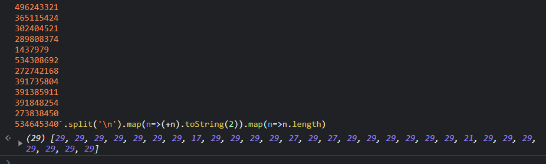
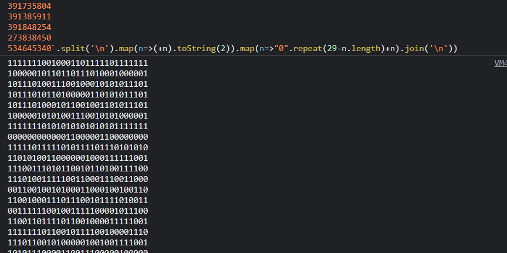
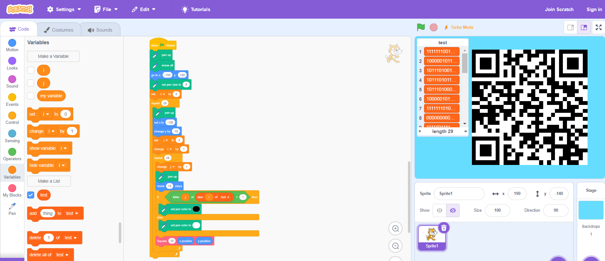

# Forensics: 1black0white

**Points:** 50

**Author:** robert-todora

**Description:** We received this file of seemingly random numbers, but the person that sent it is adamant that it is a QR code. Can you figure it out for us?

**Files:** [qr_code.txt](files/qr_code[1].txt)

## Writeup

In this challenge, the title gives away a lot of really useful information. QR codes include the colors black and white, and if 1 is black and 0 is white, maybe the QR code is encoded in the binary forms of the numbers in the list!

Starting out, we can parse through the numbers with JavaScript to get how many bits most of these numbers are.

Most seem to be 29, which is also the length of the file! This is perfect, the QR code is a perfect 29x29 square!

With a bit further parsing, we can get the data in binary, padded with 0s at the front for shorter lines.

And now, we just need to find a way to render the QR code! [Scratch](https://scratch.mit.edu/projects/editor) has a pretty good and easy-to-use GUI that also keeps you from having to create much more yourself! This could also be done with HTML5 canvas, PyGame (maybe even Turtle), or other common GUI-based frameworks, but just to make it easy, I used Scratch!

Just rendering with 1 as black and 0 as white and a list to store the binary data, and a custom block to create better squares rather than dots, we can get a QR code!

And scanning this with any smartphone, we get our flag, `csawctf{1_d1dnt_kn0w_th1s_w0uld_w0rk}`!

The Scratch project's SB3 file can also be found [here](files/Scratch%20Project.sb3)!
