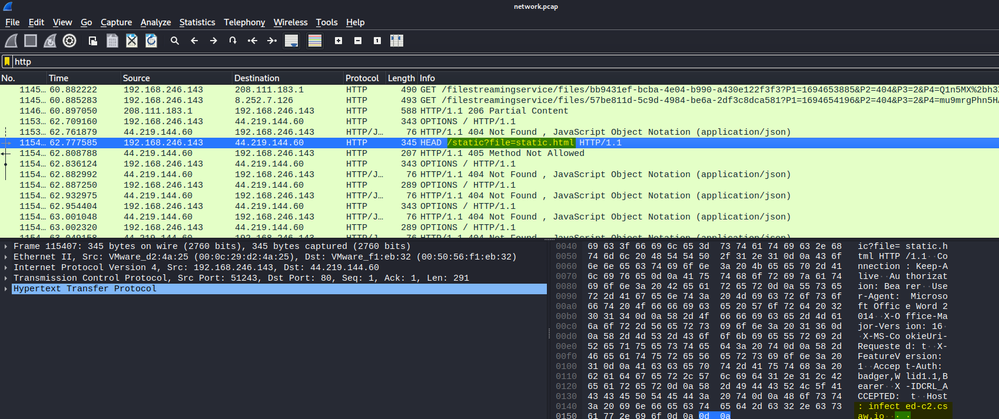
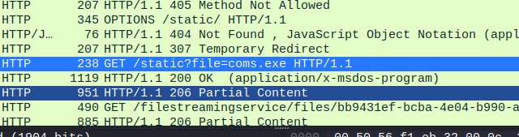
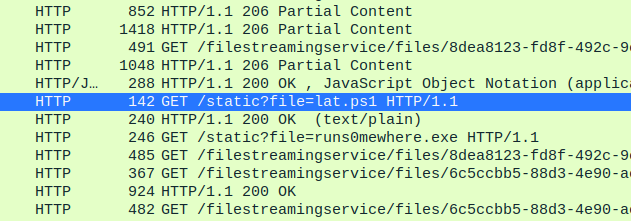
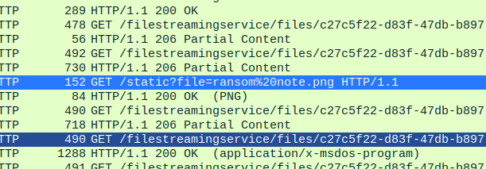

# Incident Response: What is going on?

**Points:** 382

**Description:** The HudsonHustle company has contacted you as they are not able to figure out why they can not access any of their files. Can you figure out what is going on?

**Files:** network.pcap, server2019.vmdk, win10.vmdk (downloaded from zip file in first IR challenge)

## Writeup

The easiest thing to analyze here has to be the PCAP file, which we can easily open with Wireshark! Also assuming the malware that hit HudsonHustle was downloaded through the internet and not a USB or another physical method, the packets during the download can be found here!

It takes a while for Wireshark to load the file since it's just so big, but once we're there, HTTP is usually the easiest to see useful data from, so we can start filtering by HTTP!

And when we do, we eventually see a request to a path, `/static?file=static.html`, with the host of `infected-c2.csaw.io`, which seems to be a perfect match!

Though, never open this on Windows, because this page has malware that will encrypt your files! Opening on a Linux VM is definitely a safe bet. 

Anyways, with the search feature in Wireshark, we can find more files that are downloaded!

We first find a suspicious file, `coms.exe`...

Then what appears to be a privilege escalation PowerShell file, `lat.ps1`, and our ransomware program, `runs0mewhere.exe`!

And lastly, a ransom note...

And viewing this ransom note, we can get the flag!

And the flag is `csawctf{h4ck1N6_7R41N5_F0r_D4y5!}`!
