# Incident Response: Initial Access

**Points:** 427

**Description:** How were they hacked?!?!

`nc misc.csaw.io 5001`

## Writeup

This challenge is a bit different from the others, in that it includes multiple questions. We need to connect to the listener to get the first question and answer that and the other three to get the flag!

## Question 1

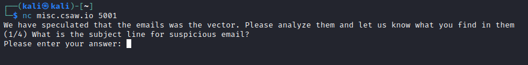

Now, we need to look for an email! The win10.vmdk file is the one to go for since it is a user workstation disk! We can add this disk to an existing VM (I used Windows) and start looking around the file system until we find an email file!

And right in John Snow's Documents, we find an Outlook file!

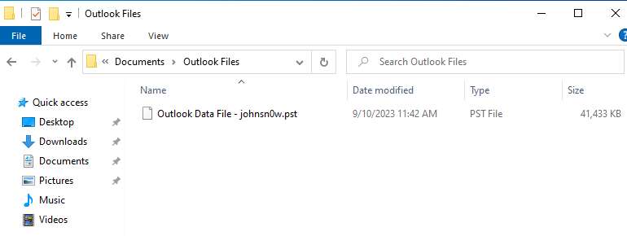

Now, we can transfer this over to our Linux VM to be safe and use a tool like GoldFynch PST Viewer to view the emails...

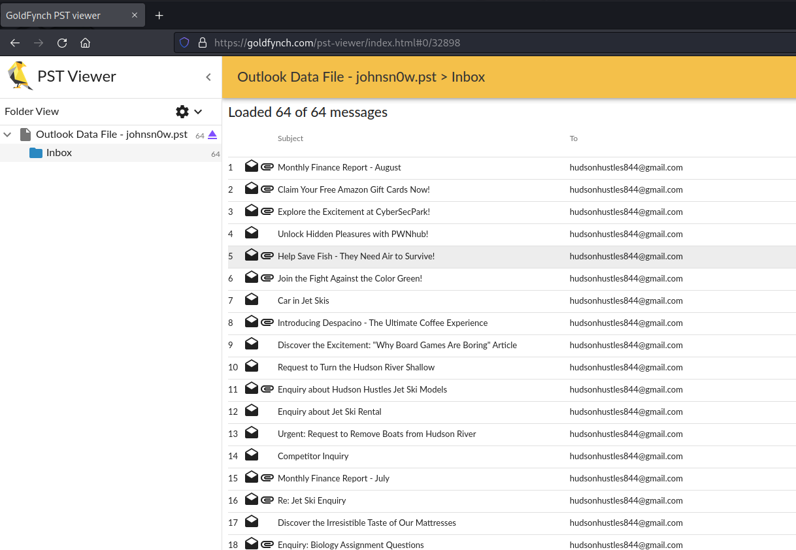

A lot of these emails seem suspicious, but one in particular stands out because of its attachments...

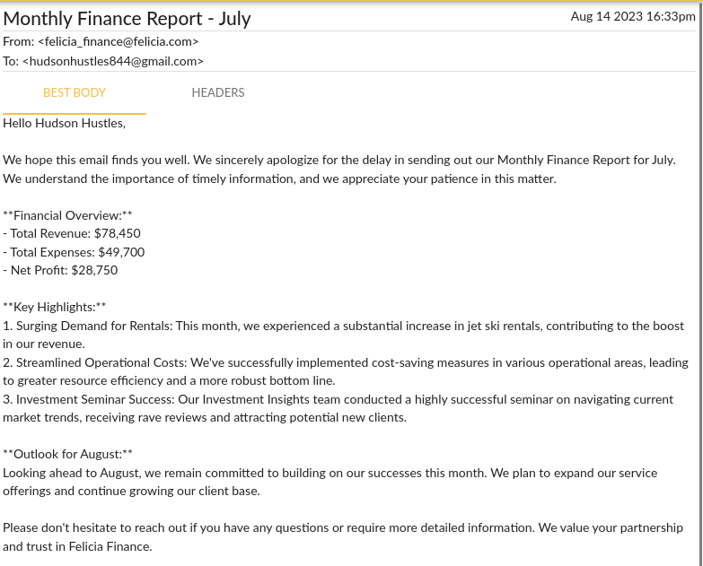

This email looks innocent, but its attachment is a .doc file...

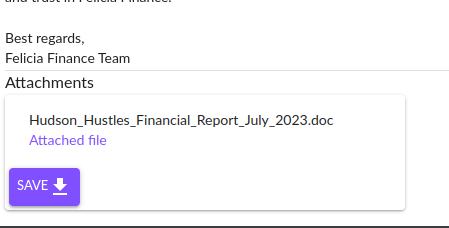

This is a file used for older versions of Microsoft Word, which most often uses .docx. In particular, this is interesting, since it is much easier to hide malware in these files than their newer counterparts! Older Word documents are macro-enabled by default, which allows attackers to run arbitrary Visual Basic code through the document! And in fact, that is exactly what this file does!

But anyways, our answer for this question is `Monthly Finance Report - July`.

### Question 2

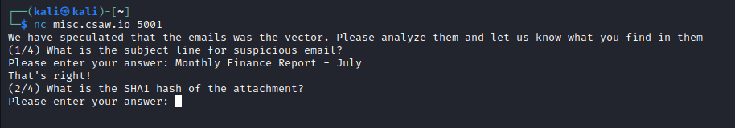

Now, finding the SHA1 hash is super easy!

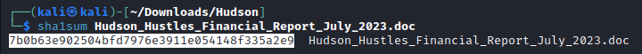

And that right there highlighted is our answer!

### Question 3

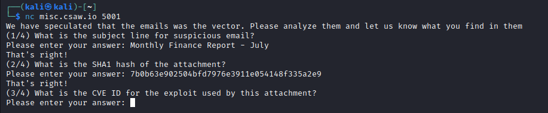

To start analyzing the malware, we can first unzip the document! Word documents are actually hidden zip files, just with special folders to store information to display the document! But unzipping allows us to analyze the data behind the document, including malware!

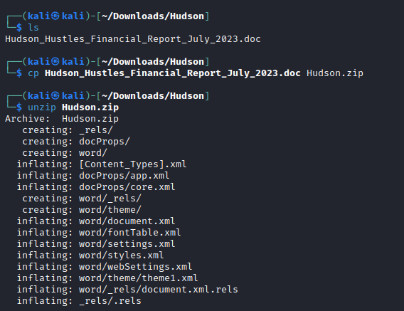

Now, we know a request must be made to `infected-c2.csaw.io` for this document to download the malware, so we can just search for "csaw" with grep!

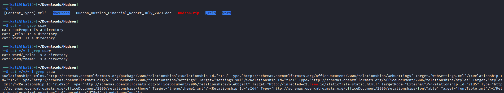

And notice right before the highlighted URL, the `oleObject`. This is key to identifying the CVE!

And when we Google it, we get the answer!

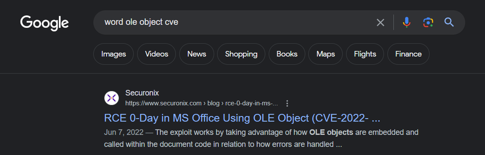

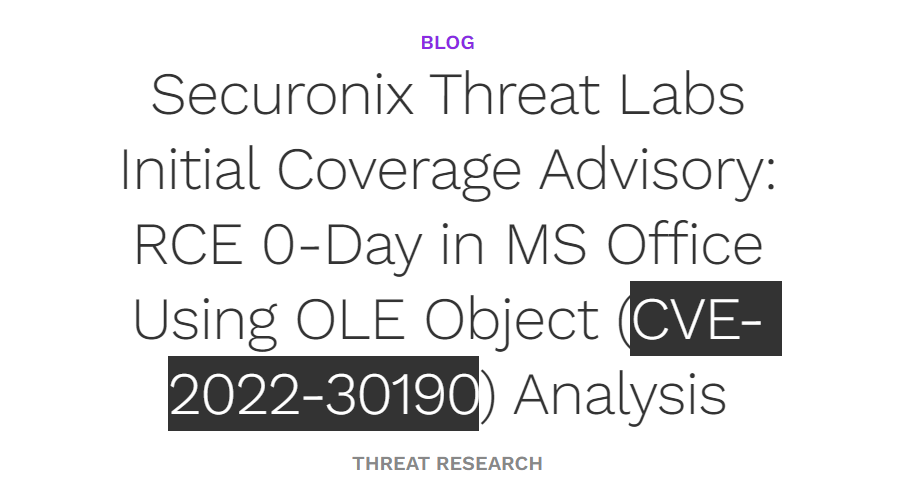

This is the link to that article: [https://www.securonix.com/blog/rce-0-day-in-ms-office-using-ole-object-cve-2022-30190-analysis/](https://www.securonix.com/blog/rce-0-day-in-ms-office-using-ole-object-cve-2022-30190-analysis/)

Anyways, our answer is `CVE-2022-30190`!

### Question 4

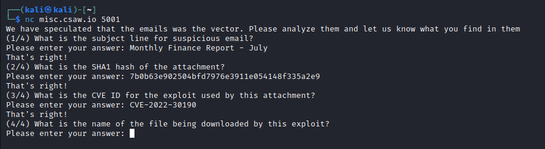

Looking back at our grep result, the URL specifically targeted is once again our `static.html` file! So what does this do?

If we run `curl` to view the content, we get an interesting payload!

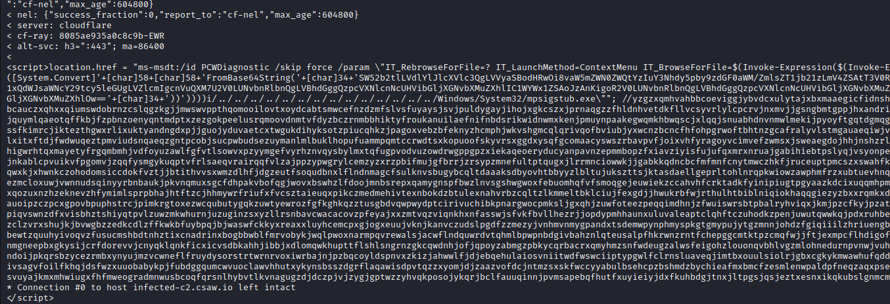

This is obfuscated, but the first part has some base64 that is then run with `Invoke-Expression` in PowerShell! 

And decoding that base64 gives us the file!

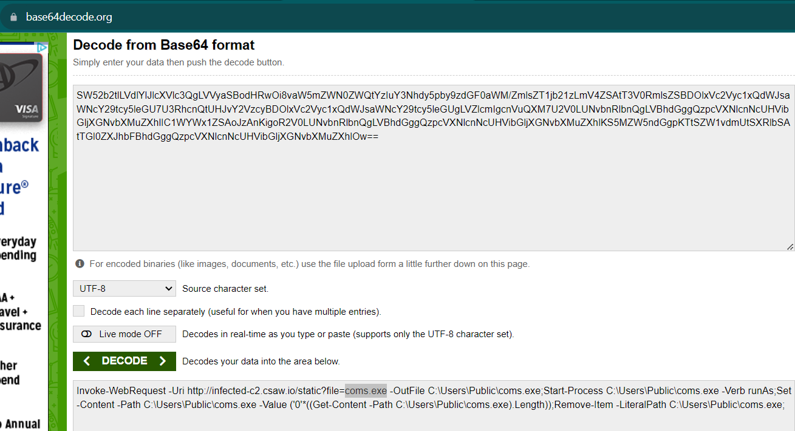

And our answer is `coms.exe`, which we can then put into the netcat session, and we get our flag!

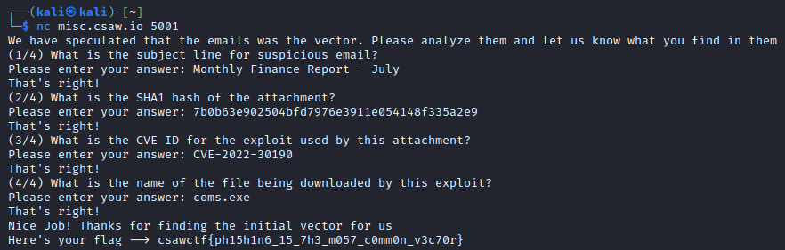

And the flag is `csawctf{ph15h1n6_15_7h3_m057_c0mm0n_v3c70r}`!
