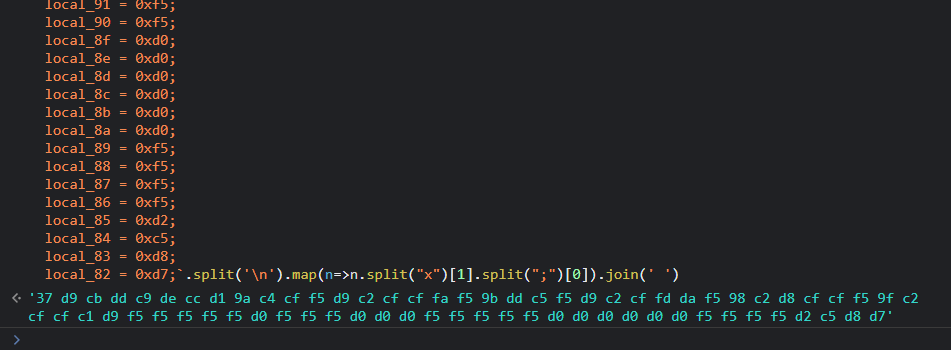
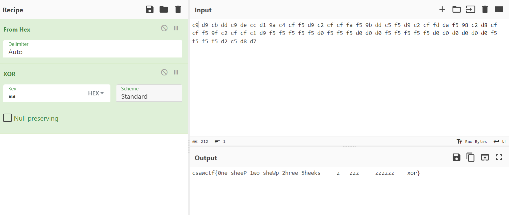

# Intro: whataxor

**Points:** 75

**Author:** ElykDeer

**Description:** Now you actually need to figure what the binary is doing.......maybe try a tool like https://dogbolt.org/; It shows you the output of several tools that try to extract a representation similar to what the original code might have looked like.....which is a lot nicer than reading bytes.

**Files:** [readme.txt](files/readme[1].txt), [whataxor](files/whataxor[1])

## Writeup

Turns out the description of this challenge already gives us the tool we can use! We can start just by uploading the binary to [dogbolt](https://dogbolt.org) and start reading through the decompiled code!

Dogbolt gives us this C code for our main function:

```c
undefined8 main(void)

{
  int iVar1;
  long in_FS_OFFSET;
  char local_c8;
  undefined local_c7;
  undefined local_c6;
  undefined local_c5;
  undefined local_c4;
  undefined local_c3;
  undefined local_c2;
  undefined local_c1;
  undefined local_c0;
  undefined local_bf;
  undefined local_be;
  undefined local_bd;
  undefined local_bc;
  undefined local_bb;
  undefined local_ba;
  undefined local_b9;
  undefined local_b8;
  undefined local_b7;
  undefined local_b6;
  undefined local_b5;
  undefined local_b4;
  undefined local_b3;
  undefined local_b2;
  undefined local_b1;
  undefined local_b0;
  undefined local_af;
  undefined local_ae;
  undefined local_ad;
  undefined local_ac;
  undefined local_ab;
  undefined local_aa;
  undefined local_a9;
  undefined local_a8;
  undefined local_a7;
  undefined local_a6;
  undefined local_a5;
  undefined local_a4;
  undefined local_a3;
  undefined local_a2;
  undefined local_a1;
  undefined local_a0;
  undefined local_9f;
  undefined local_9e;
  undefined local_9d;
  undefined local_9c;
  undefined local_9b;
  undefined local_9a;
  undefined local_99;
  undefined local_98;
  undefined local_97;
  undefined local_96;
  undefined local_95;
  undefined local_94;
  undefined local_93;
  undefined local_92;
  undefined local_91;
  undefined local_90;
  undefined local_8f;
  undefined local_8e;
  undefined local_8d;
  undefined local_8c;
  undefined local_8b;
  undefined local_8a;
  undefined local_89;
  undefined local_88;
  undefined local_87;
  undefined local_86;
  undefined local_85;
  undefined local_84;
  undefined local_83;
  undefined local_82;
  char local_78 [104];
  long local_10;
  
  local_10 = *(long *)(in_FS_OFFSET + 0x28);
  printf("Enter your password: ");
  __isoc99_scanf(&DAT_00100b1a,local_78);
  xor_transform(local_78,0xffffffaa);
  local_c8 = -0x37;
  local_c7 = 0xd9;
  local_c6 = 0xcb;
  local_c5 = 0xdd;
  local_c4 = 0xc9;
  local_c3 = 0xde;
  local_c2 = 0xcc;
  local_c1 = 0xd1;
  local_c0 = 0x9a;
  local_bf = 0xc4;
  local_be = 0xcf;
  local_bd = 0xf5;
  local_bc = 0xd9;
  local_bb = 0xc2;
  local_ba = 0xcf;
  local_b9 = 0xcf;
  local_b8 = 0xfa;
  local_b7 = 0xf5;
  local_b6 = 0x9b;
  local_b5 = 0xdd;
  local_b4 = 0xc5;
  local_b3 = 0xf5;
  local_b2 = 0xd9;
  local_b1 = 0xc2;
  local_b0 = 0xcf;
  local_af = 0xfd;
  local_ae = 0xda;
  local_ad = 0xf5;
  local_ac = 0x98;
  local_ab = 0xc2;
  local_aa = 0xd8;
  local_a9 = 0xcf;
  local_a8 = 0xcf;
  local_a7 = 0xf5;
  local_a6 = 0x9f;
  local_a5 = 0xc2;
  local_a4 = 0xcf;
  local_a3 = 0xcf;
  local_a2 = 0xc1;
  local_a1 = 0xd9;
  local_a0 = 0xf5;
  local_9f = 0xf5;
  local_9e = 0xf5;
  local_9d = 0xf5;
  local_9c = 0xf5;
  local_9b = 0xd0;
  local_9a = 0xf5;
  local_99 = 0xf5;
  local_98 = 0xf5;
  local_97 = 0xd0;
  local_96 = 0xd0;
  local_95 = 0xd0;
  local_94 = 0xf5;
  local_93 = 0xf5;
  local_92 = 0xf5;
  local_91 = 0xf5;
  local_90 = 0xf5;
  local_8f = 0xd0;
  local_8e = 0xd0;
  local_8d = 0xd0;
  local_8c = 0xd0;
  local_8b = 0xd0;
  local_8a = 0xd0;
  local_89 = 0xf5;
  local_88 = 0xf5;
  local_87 = 0xf5;
  local_86 = 0xf5;
  local_85 = 0xd2;
  local_84 = 0xc5;
  local_83 = 0xd8;
  local_82 = 0xd7;
  iVar1 = strcmp(local_78,&local_c8);
  if (iVar1 == 0) {
    puts("Correct!");
  }
  else {
    puts("Access denied.");
  }
  if (local_10 != *(long *)(in_FS_OFFSET + 0x28)) {
                    // WARNING: Subroutine does not return
    __stack_chk_fail();
  }
  return 0;
}
```

Most notably perhaps, there is a call to a function, `xor_transform` with the parameters being `local_78` (which is the string we input into the program) and `0xffffffaa`. Then, this is compared to another string starting at `local_c8`. However, with endianness in mind, this actually goes backwards from `local_c8` to `local_82`, which is thankfully in order for us in the decompiled code!

Using a bit of JavaScript to parse this for us, we can get our hexadecimal string to run XOR on!



However, once we copy this into [CyberChef](https://gchq.github.io/CyberChef/), we need to check the first byte. In the code, it is `-0x37`, which when unsigned is the same as `0x100 - 0x37 = 0xc9`, which we should use instead! Also we can remove the "f"s padding the XOR key since we're only using single-byte hexadecimal values rather than UTF-8. 



But ultimately, we can get our flag, `csawctf{0ne_sheeP_1wo_sheWp_2hree_5heeks_____z___zzz_____zzzzzz____xor}`!
