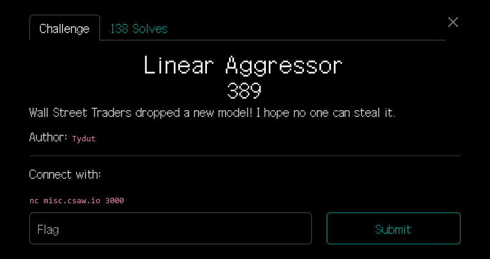
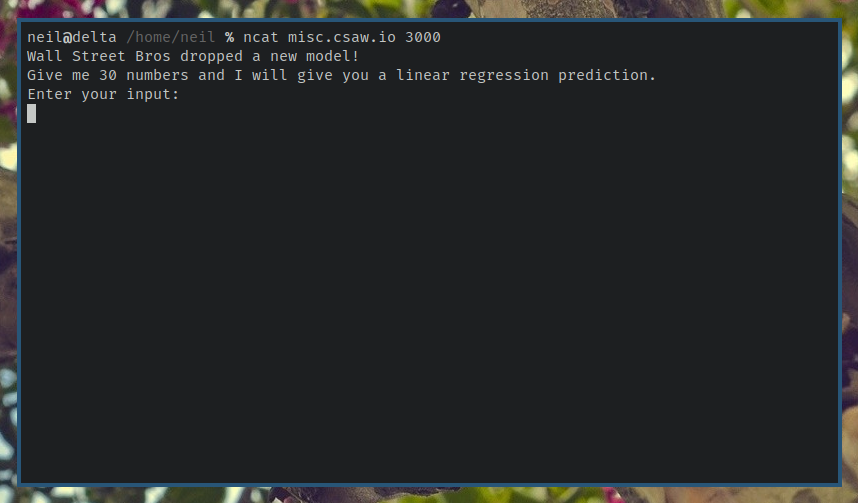
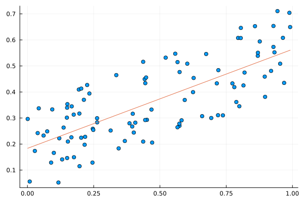
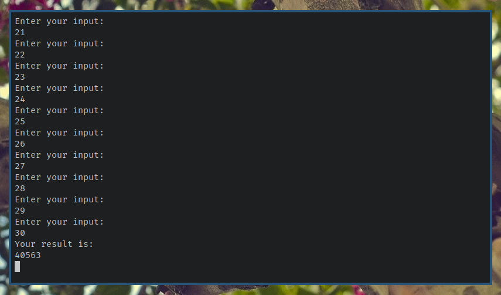

# Misc: Linear Aggressor

**Points:** 389

**Author:** Tydut

**Description:** Wall street traders dropped a new model! I hope no one can steal it.

**Written By:** Neil Svedberg

This writeup can also be found on [muuu.net](https://muuu.net/2023-09-18/).

## Writeup

After competing in the capture-the-flag event hosted by CSAW, I wanted to do a
write up of the "Linear Aggressor" challenge. This challenge looks kind of
obtuse at first, but it's fairly simple once you know what the trick is.

Here is the description of the challenge:



Okay, no idea what this is about so far. Let's connect to that server and see
what it says.



Okay, it's a "linear regression prediction". What's that?

A **linear regression** is a model that predicts what some data in the future
may be, based on data that you have from the past. Essentially, a linear
regression works by drawing a line that is the best fit of the data you have.

Here is some random data (the blue dots), and a linear regression which
approximates our data (the red line). The line corresponds to `y(x) = 0.381*x +
0.183`.



We can say that this model has *two parameters*, `0.318` and `0.183`. If we
change either of these two parameters, the line will change as well.

Linear regressions aren't the only kind of regressions used for modeling data.
You could imagine modeling the same data above using a curve instead of a line.
However, linear regressions are used quite a bit in data science. They tend to
give good results for a comparatively small amount of complexity.

Another interesting property of linear functions such as these is that the
combination of any two linear functions, a **linear combination**, is itself a
linear function. This is why in cryptography it's important to have
*non-linear* steps in an encryption algorithm. If every step was a linear
operation, then the algorithm as a whole could be expressed as a linear
operation, and would be vulnerable to linear cryptanalysis.

Anyways, let's give the model some numbers:



Okay, so it takes in 30 numbers and outputs 1 number. If we assume that the
model really is a linear regression like they say, then it should look someting
like this:

`y(x) = a<sub>1</sub>*x<sub>1</sub> + a<sub>2</sub>*x<sub>2</sub> + a<sub>3</sub>*x<sub>3</sub> + a<sub>4</sub>*x<sub>4</sub> + a<sub>5</sub>*x<sub>5</sub> + ... + a<sub>30</sub>*x<sub>30</sub> + a<sub>31</sub></code>`

As you can see, there are 31 parameters. 30 for each of the inputs plus a
constant parameter at the end. This model is more difficult to imagine as a
line, because it'd be a 31-dimensional line, but hopefully you get the idea.

Let's write some code. First of all, to make this easier, I'll write a function
that takes a vector of 30 numbers and gives us the number returned by the
model.

```julia
using Sockets

function result(N)
    sock = connect("misc.csaw.io", 3000)

    for n in N
        write(sock, string(n) * '\n')
    end

    while true
        line = readline(sock)

        if isempty(line)
            error("failed to read output")
        elseif line == "Your result is:"
            return(parse(Int64, readline(sock)))
        end
    end
end
```

We can test that it works:

```julia
result(rand(1:100, 30))

# => 153712
```

Now, the idea is to steal the parameters from the model. One parameter is easy
to get: if we give the models all zeros, the only thing left will be the last
parameter, `a<sub>31</sub>`.

```julia
a31 = result(fill(0, 30))

# => 125
```

The other parameters are slightly more complicated.

Let's consider the first parameter, `a<sub>1</sub>`. We can give the model 1 as
the first number, and 0 for all other numbers. This gives us `a<sub>1</sub> +
a<sub>31</sub>`, because the zeroes eliminate all of the other parameters.

Since we know the value of `a<sub>31</sub>`, we can subtract this from the
result that we receive, and we are left with our parameter.
a
The same logic holds for each of the other parameters. First, let's create a
matrix, known as the **identity matrix**.

```julia
I = [Int(x==y) for x in 1:30, y in 1:30]
```

The matrix looks like this:

```
1  0  0  0  0  0  0  0  0  0  0  0  &#8230;  0  0  0  0  0  0  0  0  0  0  0  0
0  1  0  0  0  0  0  0  0  0  0  0     0  0  0  0  0  0  0  0  0  0  0  0
0  0  1  0  0  0  0  0  0  0  0  0     0  0  0  0  0  0  0  0  0  0  0  0
0  0  0  1  0  0  0  0  0  0  0  0     0  0  0  0  0  0  0  0  0  0  0  0
0  0  0  0  1  0  0  0  0  0  0  0     0  0  0  0  0  0  0  0  0  0  0  0
0  0  0  0  0  1  0  0  0  0  0  0  &#8230;  0  0  0  0  0  0  0  0  0  0  0  0
0  0  0  0  0  0  1  0  0  0  0  0     0  0  0  0  0  0  0  0  0  0  0  0
0  0  0  0  0  0  0  1  0  0  0  0     0  0  0  0  0  0  0  0  0  0  0  0
0  0  0  0  0  0  0  0  1  0  0  0     0  0  0  0  0  0  0  0  0  0  0  0
0  0  0  0  0  0  0  0  0  1  0  0     0  0  0  0  0  0  0  0  0  0  0  0
0  0  0  0  0  0  0  0  0  0  1  0  &#8230;  0  0  0  0  0  0  0  0  0  0  0  0
0  0  0  0  0  0  0  0  0  0  0  1     0  0  0  0  0  0  0  0  0  0  0  0
&#8942;              &#8942;              &#8942;     &#8945;        &#8942;              &#8942;
0  0  0  0  0  0  0  0  0  0  0  0     1  0  0  0  0  0  0  0  0  0  0  0
0  0  0  0  0  0  0  0  0  0  0  0     0  1  0  0  0  0  0  0  0  0  0  0
0  0  0  0  0  0  0  0  0  0  0  0  &#8230;  0  0  1  0  0  0  0  0  0  0  0  0
0  0  0  0  0  0  0  0  0  0  0  0     0  0  0  1  0  0  0  0  0  0  0  0
0  0  0  0  0  0  0  0  0  0  0  0     0  0  0  0  1  0  0  0  0  0  0  0
0  0  0  0  0  0  0  0  0  0  0  0     0  0  0  0  0  1  0  0  0  0  0  0
0  0  0  0  0  0  0  0  0  0  0  0     0  0  0  0  0  0  1  0  0  0  0  0
0  0  0  0  0  0  0  0  0  0  0  0  &#8230;  0  0  0  0  0  0  0  1  0  0  0  0
0  0  0  0  0  0  0  0  0  0  0  0     0  0  0  0  0  0  0  0  1  0  0  0
0  0  0  0  0  0  0  0  0  0  0  0     0  0  0  0  0  0  0  0  0  1  0  0
0  0  0  0  0  0  0  0  0  0  0  0     0  0  0  0  0  0  0  0  0  0  1  0
0  0  0  0  0  0  0  0  0  0  0  0     0  0  0  0  0  0  0  0  0  0  0  1
```

Each value is zero except the values along the main diagonal, which are one.

Now, we can use each row of this matrix to get the parameters of the model.
Remember, like above, we have to subtract the constant parameter.

```julia
A = [result(row) - a31 for row in eachrow(I)]

# => 99, 115, 97, 119, 99, 116, 102, 123, 109, 48, 100, 51, 49, 95, 53, 116,
# 51, 52, 49, 105, 110, 103, 95, 105, 53, 95, 98, 52, 100, 125
```

These are the remaining parameters of the model! Also, they look suspiciously
like ASCII values. Let's try to print them.

```julia
println(join(Char.(A)))

# => csawctf{m0d31\_5t341ing\_i5\_b4d}
```

Like many other CTF puzzles, it's easy once you know the trick! I hope you
found this write-up useful.

Let's all love lain!
