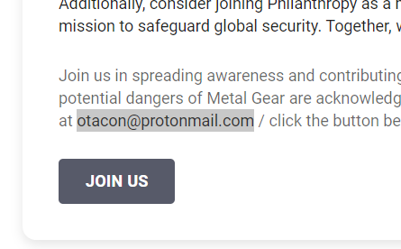
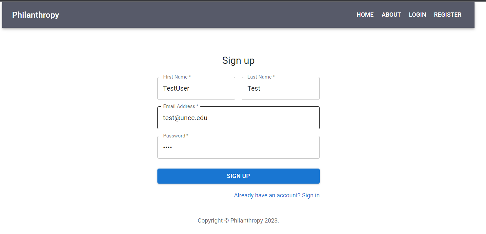
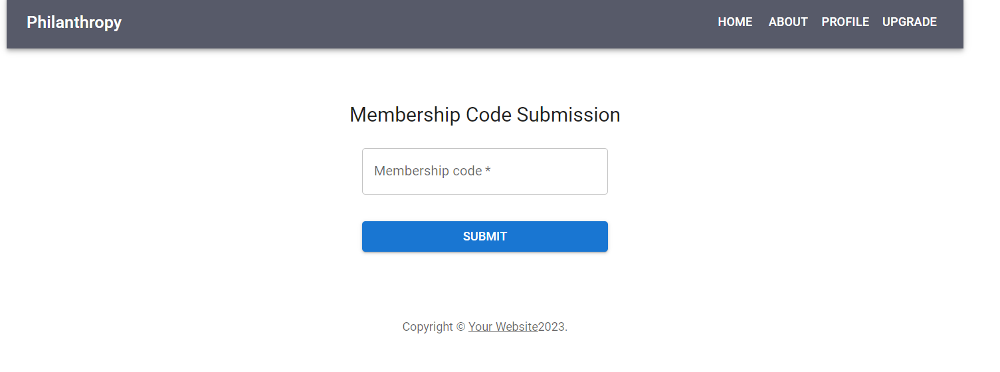
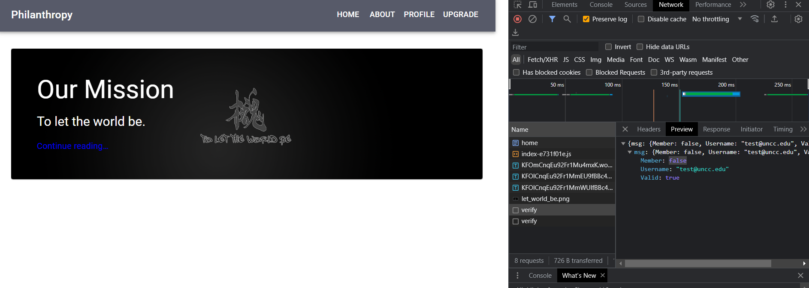
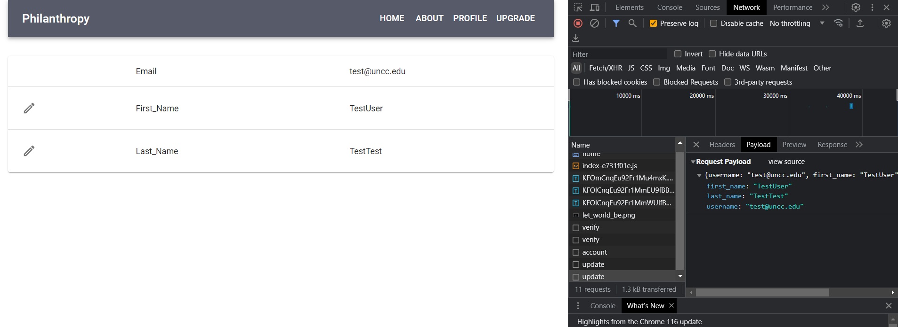
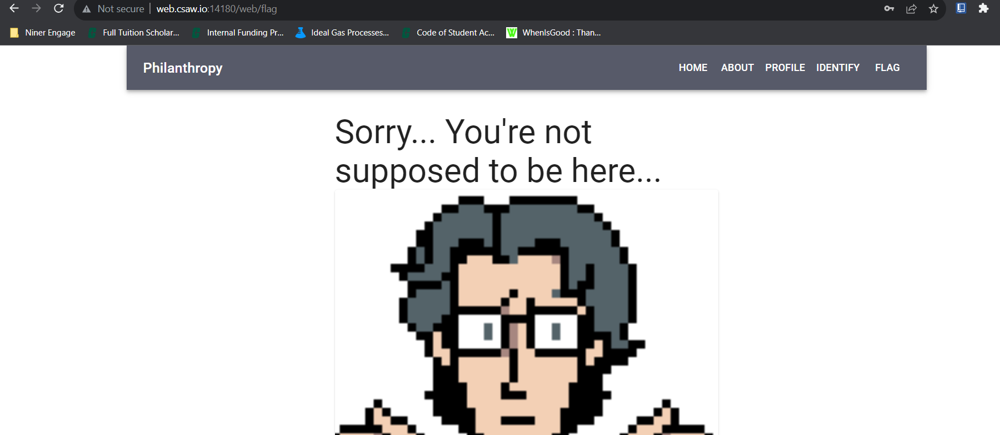
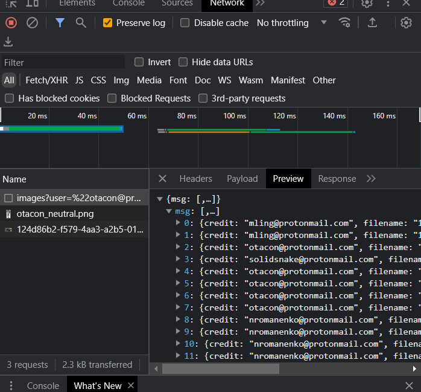
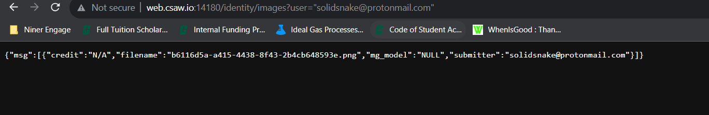
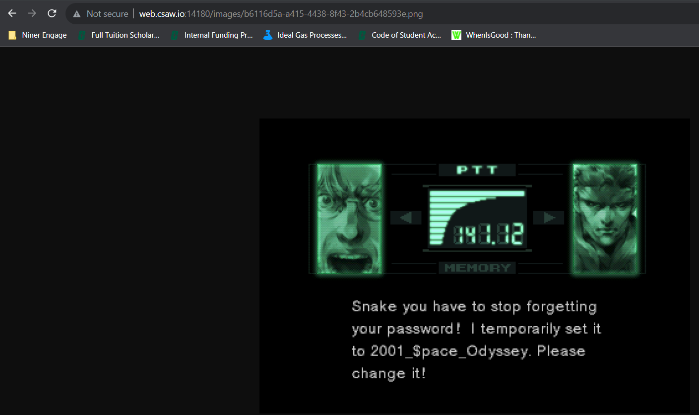
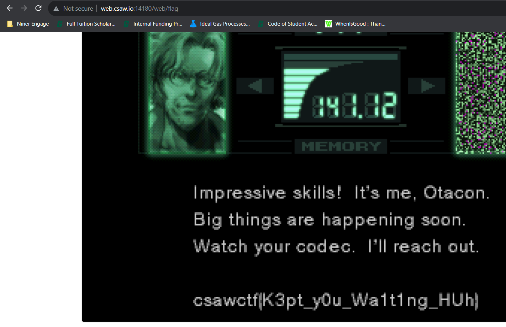

# Web: Philanthropy

**Points:** 186

**Author:** Enigma

**Description:** Can you break into the Philanthropy website and get more information on Snake and Otacon?

**Links:** [http://web.csaw.io:14180/web/home](http://web.csaw.io:14180/web/home)

## Writeup

As always with any web challenge, the first step is recon!

The challenge description gives us our targets: two users known as Snake and Otacon. Well, right on the about page is information on Otacon's email!



Anyways, there isn't much else that we can see before logging in, so we can register a new fake user and log in!



Now that we're logged in, we can see a bit more, including a tab for "Profile" and a tab for "Membership". The latter hints at access control which may help us get the information we need to get the flag!

Looking at the Membership tab, we see a prompt for a code. We don't have a code right now, but this does verify that there is a way to get a membership for the website and access more information!



This membership must be stored somewhere to be used, and it might also be included in web requests! In particular, using the DevTools Network tab, we can see an endpoint, `/identity/verify`, which includes this information.



Since the `Member` attribute is false, we may be able to modify this information!

Once we look at the Profile tab, we can see that we do have the ability to modify our user's information, including the display name. And when we modify it, we can see a request to `/identity/update` that we can capture!



We can use JavaScript to send this request with `fetch`!

```js
fetch("http://web.csaw.io:14180/identity/update", {
  "headers": {
    "accept": "application/json, text/plain, */*",
    "accept-language": "en-US,en;q=0.9",
    "content-type": "application/json"
  },
  "referrer": "http://web.csaw.io:14180/web/profile",
  "referrerPolicy": "strict-origin-when-cross-origin",
  "body": "{\"username\":\"test@uncc.edu\",\"first_name\":\"TestUser\",\"last_name\":\"TestTest\", \"member\":true}",
  "method": "POST",
  "mode": "cors",
  "credentials": "include"
});
```

This is pretty easy to do since we can just copy the result as fetch and add `\"member\":true` to make ourselves a member.

This update doesn't show immediately, but if we clear cookies and refresh, we can see that we are now a member and have access to even more, including a flag page!



However, we cannot see the flag at this page and need to do a bit more digging! We do have access to another page, Identify, though! The page includes a mini quiz game to identify pictures of "Metal Gear" robots. When these images are loaded, we can see that the request is directly tied to Otacon's email!



We can also see credit to `solidsnake@protonmail.com`, which seems to be our other target, so let's check that by modifying the URL and opening in a new tab!



And opening the image specified, we get a password!



And logging in, we can access the flag!



And our flag is `csawctf{K3pt_y0u_Wa1t1ng_HUh}`!
